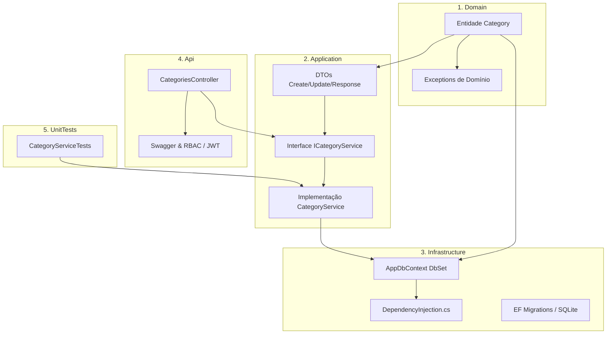

# 📘 Guia Passo a Passo: Criação de um CRUD Completo em .NET 8 (Clean Architecture)

Este guia prático ensina o passo a passo exato para criar um novo **CRUD completo** nesta solução, seguindo os padrões corporativos de **Clean Architecture**, **Entity Framework Core**, **DTOs**, **Injeção de Dependência**, **Tratamento Global de Exceções** e **Testes de Unidade**.

Para este tutorial, utilizaremos como exemplo a criação do CRUD de **Categorias (`Category`)**.

---

## 🏗️ 1. Visão Geral da Arquitetura e Fluxo de Dados

A solução está dividida em 5 camadas independentes. A regra de ouro é **desenvolver de dentro para fora** (do núcleo de regras de negócio para a borda externa da API):



---

## 🗺️ 2. Ordem de Execução

| Etapa | Projeto / Camada | O que fazer |
| :--- | :--- | :--- |
| **1** | `ShopApi.Domain` | Criar a Entidade herdando de `BaseEntity` |
| **2** | `ShopApi.Application` | Criar os DTOs de Entrada/Saída com Validações |
| **3** | `ShopApi.Application` | Criar a Interface `ICategoryService` |
| **4** | `ShopApi.Application` | Implementar a classe `CategoryService` |
| **5** | `ShopApi.Infrastructure` | Adicionar o `DbSet` no `AppDbContext` e registrar no `DependencyInjection.cs` |
| **6** | `ShopApi.Infrastructure` | Criar e aplicar a Migration no banco de dados |
| **7** | `ShopApi.Api` | Criar o `CategoriesController` com rotas, segurança e Swagger |
| **8** | `ShopApi.UnitTests` | Criar testes unitários para validar regras e fluxos do Service |

---

## 📝 Passo 1: Camada `Domain` (Entidade)

A camada de Domínio não possui dependência de frameworks externos nem do banco de dados.

### 1.1 Criar a Entidade `Category.cs`
Crie o arquivo em `ShopApi.Domain/Entities/Category.cs`:

```csharp
namespace ShopApi.Domain.Entities;

/// <summary>
/// Representa a entidade de Categoria no domínio do sistema.
/// Herda de BaseEntity (Id [Guid], CreatedAt [DateTime], UpdatedAt [DateTime?]).
/// </summary>
public class Category : BaseEntity
{
    public string Name { get; set; } = string.Empty;

    public string Description { get; set; } = string.Empty;

    // Flag para desativação lógica (opcional)
    public bool IsActive { get; set; } = true;
}
```

> 💡 **Nota:** Se a entidade precisar de exceções específicas, a solução já possui em `ShopApi.Domain/Exceptions/AppExceptions.cs`:
> - `NotFoundException` (HTTP 404)
> - `ConflictException` (HTTP 409)
> - `BadRequestException` (HTTP 400)
> - `UnauthorizedException` (HTTP 401)
> - `ForbiddenException` (HTTP 403)

---

## 📦 Passo 2: Camada `Application` (DTOs, Interfaces e Service)

A camada de Aplicação orquestra os casos de uso, validações de entrada e transformações de dados.

### 2.1 Criar os DTOs em `ShopApi.Application/DTOs/Categories/CategoryDtos.cs`

```csharp
using System.ComponentModel.DataAnnotations;
using ShopApi.Domain.Entities;

namespace ShopApi.Application.DTOs.Categories;

/// <summary>
/// DTO de entrada para criação de categoria (POST /api/categories)
/// </summary>
public class CreateCategoryDto
{
    [Required(ErrorMessage = "O nome da categoria é obrigatório.")]
    [StringLength(100, MinimumLength = 2, ErrorMessage = "O nome deve ter entre 2 e 100 caracteres.")]
    public string Name { get; set; } = string.Empty;

    [StringLength(300, ErrorMessage = "A descrição pode ter no máximo 300 caracteres.")]
    public string Description { get; set; } = string.Empty;
}

/// <summary>
/// DTO de entrada para atualização de categoria (PUT /api/categories/{id})
/// </summary>
public class UpdateCategoryDto
{
    [Required(ErrorMessage = "O nome da categoria é obrigatório.")]
    [StringLength(100, MinimumLength = 2, ErrorMessage = "O nome deve ter entre 2 e 100 caracteres.")]
    public string Name { get; set; } = string.Empty;

    [StringLength(300, ErrorMessage = "A descrição pode ter no máximo 300 caracteres.")]
    public string Description { get; set; } = string.Empty;

    public bool IsActive { get; set; } = true;
}

/// <summary>
/// DTO de saída com os dados retornados pela API
/// </summary>
public class CategoryResponseDto
{
    public Guid Id { get; set; }
    public string Name { get; set; } = string.Empty;
    public string Description { get; set; } = string.Empty;
    public bool IsActive { get; set; }
    public DateTime CreatedAt { get; set; }
    public DateTime? UpdatedAt { get; set; }

    public static CategoryResponseDto FromEntity(Category category)
    {
        return new CategoryResponseDto
        {
            Id = category.Id,
            Name = category.Name,
            Description = category.Description,
            IsActive = category.IsActive,
            CreatedAt = category.CreatedAt,
            UpdatedAt = category.UpdatedAt
        };
    }
}
```

### 2.2 Adicionar o contrato na Interface `IApplicationDbContext.cs`
Edite `ShopApi.Application/Interfaces/Common/IApplicationDbContext.cs` e adicione o `DbSet<Category>`:

```csharp
DbSet<Category> Categories { get; }
```

### 2.3 Criar a Interface `ICategoryService.cs`
Crie ou adicione em `ShopApi.Application/Interfaces/Services/ServiceInterfaces.cs`:

```csharp
using ShopApi.Application.DTOs.Categories;

namespace ShopApi.Application.Interfaces.Services;

public interface ICategoryService
{
    Task<IEnumerable<CategoryResponseDto>> GetAllAsync(CancellationToken cancellationToken = default);
    Task<CategoryResponseDto> GetByIdAsync(Guid id, CancellationToken cancellationToken = default);
    Task<CategoryResponseDto> CreateAsync(CreateCategoryDto dto, CancellationToken cancellationToken = default);
    Task<CategoryResponseDto> UpdateAsync(Guid id, UpdateCategoryDto dto, CancellationToken cancellationToken = default);
    Task DeleteAsync(Guid id, CancellationToken cancellationToken = default);
}
```

### 2.4 Implementar o `CategoryService.cs`
Crie o arquivo em `ShopApi.Application/Services/CategoryService.cs`:

```csharp
using Microsoft.EntityFrameworkCore;
using ShopApi.Application.DTOs.Categories;
using ShopApi.Application.Interfaces.Common;
using ShopApi.Application.Interfaces.Services;
using ShopApi.Domain.Entities;
using ShopApi.Domain.Exceptions;

namespace ShopApi.Application.Services;

public class CategoryService : ICategoryService
{
    private readonly IApplicationDbContext _context;

    public CategoryService(IApplicationDbContext context)
    {
        _context = context;
    }

    public async Task<IEnumerable<CategoryResponseDto>> GetAllAsync(CancellationToken cancellationToken = default)
    {
        var categories = await _context.Categories
            .AsNoTracking()
            .OrderBy(c => c.Name)
            .ToListAsync(cancellationToken);

        return categories.Select(CategoryResponseDto.FromEntity);
    }

    public async Task<CategoryResponseDto> GetByIdAsync(Guid id, CancellationToken cancellationToken = default)
    {
        var category = await _context.Categories
            .AsNoTracking()
            .FirstOrDefaultAsync(c => c.Id == id, cancellationToken);

        if (category == null)
            throw new NotFoundException($"Categoria com ID '{id}' não foi encontrada.");

        return CategoryResponseDto.FromEntity(category);
    }

    public async Task<CategoryResponseDto> CreateAsync(CreateCategoryDto dto, CancellationToken cancellationToken = default)
    {
        var nameNormalized = dto.Name.Trim();

        var exists = await _context.Categories
            .AnyAsync(c => c.Name.ToLower() == nameNormalized.ToLower(), cancellationToken);

        if (exists)
            throw new ConflictException($"Já existe uma categoria cadastrada com o nome '{nameNormalized}'.");

        var category = new Category
        {
            Name = nameNormalized,
            Description = dto.Description?.Trim() ?? string.Empty,
            IsActive = true
        };

        _context.Categories.Add(category);
        await _context.SaveChangesAsync(cancellationToken);

        return CategoryResponseDto.FromEntity(category);
    }

    public async Task<CategoryResponseDto> UpdateAsync(Guid id, UpdateCategoryDto dto, CancellationToken cancellationToken = default)
    {
        var category = await _context.Categories
            .FirstOrDefaultAsync(c => c.Id == id, cancellationToken);

        if (category == null)
            throw new NotFoundException($"Categoria com ID '{id}' não foi encontrada.");

        var nameNormalized = dto.Name.Trim();

        var duplicateName = await _context.Categories
            .AnyAsync(c => c.Name.ToLower() == nameNormalized.ToLower() && c.Id != id, cancellationToken);

        if (duplicateName)
            throw new ConflictException($"Já existe outra categoria cadastrada com o nome '{nameNormalized}'.");

        category.Name = nameNormalized;
        category.Description = dto.Description?.Trim() ?? string.Empty;
        category.IsActive = dto.IsActive;
        category.UpdatedAt = DateTime.UtcNow;

        await _context.SaveChangesAsync(cancellationToken);

        return CategoryResponseDto.FromEntity(category);
    }

    public async Task DeleteAsync(Guid id, CancellationToken cancellationToken = default)
    {
        var category = await _context.Categories
            .FirstOrDefaultAsync(c => c.Id == id, cancellationToken);

        if (category == null)
            throw new NotFoundException($"Categoria com ID '{id}' não foi encontrada.");

        _context.Categories.Remove(category);
        await _context.SaveChangesAsync(cancellationToken);
    }
}
```

---

## 🗄️ Passo 3: Camada `Infrastructure` (DbContext, DI e Migrations)

### 3.1 Adicionar a Tabela no `AppDbContext.cs`
Edite `ShopApi.Infrastructure/Data/AppDbContext.cs`:

1. Adicione a propriedade:
```csharp
public DbSet<Category> Categories => Set<Category>();
```

2. No método `OnModelCreating`, configure índices e restrições:
```csharp
builder.Entity<Category>(entity =>
{
    entity.HasKey(c => c.Id);
    entity.Property(c => c.Name).IsRequired().HasMaxLength(100);
    entity.Property(c => c.Description).HasMaxLength(300);
    entity.HasIndex(c => c.Name).IsUnique();
});
```

### 3.2 Registrar no Contêiner de Injeção de Dependência
Edite `ShopApi.Infrastructure/DependencyInjection.cs`:

```csharp
services.AddScoped<ICategoryService, CategoryService>();
```

### 3.3 Criar e Executar a Migration
Abra o terminal na raiz da solução e execute:

```bash
# 1. Cria a Migration com as alterações do modelo
dotnet ef migrations add AddCategoriesTable --project ShopApi.Infrastructure/ShopApi.Infrastructure.csproj --startup-project ShopApi.Api/ShopApi.Api.csproj

# 2. Aplica a migration no banco de dados SQLite
dotnet ef database update --project ShopApi.Infrastructure/ShopApi.Infrastructure.csproj --startup-project ShopApi.Api/ShopApi.Api.csproj
```

---

## 🌐 Passo 4: Camada `Api` (Controller REST & Swagger)

Crie o arquivo em `ShopApi.Api/Controllers/CategoriesController.cs`:

```csharp
using Microsoft.AspNetCore.Authorization;
using Microsoft.AspNetCore.Mvc;
using ShopApi.Application.DTOs.Categories;
using ShopApi.Application.Interfaces.Services;

namespace ShopApi.Api.Controllers;

public class CategoriesController : BaseApiController
{
    private readonly ICategoryService _categoryService;

    public CategoriesController(ICategoryService categoryService)
    {
        _categoryService = categoryService;
    }

    /// <summary>
    /// Lista todas as categorias cadastradas (Acesso Público)
    /// </summary>
    [HttpGet]
    [AllowAnonymous]
    [ProducesResponseType(typeof(IEnumerable<CategoryResponseDto>), StatusCodes.Status200OK)]
    public async Task<ActionResult<IEnumerable<CategoryResponseDto>>> GetAll(CancellationToken cancellationToken)
    {
        var result = await _categoryService.GetAllAsync(cancellationToken);
        return Ok(result);
    }

    /// <summary>
    /// Busca uma categoria pelo ID (Acesso Público)
    /// </summary>
    [HttpGet("{id:guid}")]
    [AllowAnonymous]
    [ProducesResponseType(typeof(CategoryResponseDto), StatusCodes.Status200OK)]
    [ProducesResponseType(StatusCodes.Status404NotFound)]
    public async Task<ActionResult<CategoryResponseDto>> GetById(Guid id, CancellationToken cancellationToken)
    {
        var result = await _categoryService.GetByIdAsync(id, cancellationToken);
        return Ok(result);
    }

    /// <summary>
    /// Cria uma nova categoria (Requer papel 'Admin' ou 'Manager')
    /// </summary>
    [HttpPost]
    [Authorize(Roles = "Admin,Manager")]
    [ProducesResponseType(typeof(CategoryResponseDto), StatusCodes.Status201Created)]
    [ProducesResponseType(StatusCodes.Status400BadRequest)]
    [ProducesResponseType(StatusCodes.Status401Unauthorized)]
    [ProducesResponseType(StatusCodes.Status403Forbidden)]
    [ProducesResponseType(StatusCodes.Status409Conflict)]
    public async Task<ActionResult<CategoryResponseDto>> Create(
        [FromBody] CreateCategoryDto dto,
        CancellationToken cancellationToken)
    {
        var result = await _categoryService.CreateAsync(dto, cancellationToken);
        return CreatedAtAction(nameof(GetById), new { id = result.Id }, result);
    }

    /// <summary>
    /// Atualiza uma categoria existente (Requer papel 'Admin' ou 'Manager')
    /// </summary>
    [HttpPut("{id:guid}")]
    [Authorize(Roles = "Admin,Manager")]
    [ProducesResponseType(typeof(CategoryResponseDto), StatusCodes.Status200OK)]
    [ProducesResponseType(StatusCodes.Status400BadRequest)]
    [ProducesResponseType(StatusCodes.Status401Unauthorized)]
    [ProducesResponseType(StatusCodes.Status403Forbidden)]
    [ProducesResponseType(StatusCodes.Status404NotFound)]
    [ProducesResponseType(StatusCodes.Status409Conflict)]
    public async Task<ActionResult<CategoryResponseDto>> Update(
        Guid id,
        [FromBody] UpdateCategoryDto dto,
        CancellationToken cancellationToken)
    {
        var result = await _categoryService.UpdateAsync(id, dto, cancellationToken);
        return Ok(result);
    }

    /// <summary>
    /// Remove uma categoria permanentemente (EXCLUSIVO para 'Admin')
    /// </summary>
    [HttpDelete("{id:guid}")]
    [Authorize(Roles = "Admin")]
    [ProducesResponseType(StatusCodes.Status204NoContent)]
    [ProducesResponseType(StatusCodes.Status401Unauthorized)]
    [ProducesResponseType(StatusCodes.Status403Forbidden)]
    [ProducesResponseType(StatusCodes.Status404NotFound)]
    public async Task<IActionResult> Delete(Guid id, CancellationToken cancellationToken)
    {
        await _categoryService.DeleteAsync(id, cancellationToken);
        return NoContent();
    }
}
```

---

## 🧪 Passo 5: Camada `UnitTests` (Testes de Unidade)

Crie o arquivo de testes em `ShopApi.UnitTests/Services/CategoryServiceTests.cs`:

```csharp
using FluentAssertions;
using ShopApi.Application.DTOs.Categories;
using ShopApi.Application.Services;
using ShopApi.Domain.Entities;
using ShopApi.Domain.Exceptions;
using ShopApi.UnitTests.Helpers;
using Xunit;

namespace ShopApi.UnitTests.Services;

public class CategoryServiceTests
{
    [Fact]
    public async Task CreateAsync_WhenValid_ShouldPersistAndReturnDto()
    {
        // Arrange
        using var context = TestDbContextFactory.Create();
        var service = new CategoryService(context);
        var dto = new CreateCategoryDto { Name = "Eletrônicos", Description = "Gadgets e informática" };

        // Act
        var result = await service.CreateAsync(dto);

        // Assert
        result.Should().NotBeNull();
        result.Id.Should().NotBeEmpty();
        result.Name.Should().Be("Eletrônicos");
        result.IsActive.Should().BeTrue();
    }

    [Fact]
    public async Task CreateAsync_WhenDuplicateName_ShouldThrowConflictException()
    {
        // Arrange
        using var context = TestDbContextFactory.Create();
        context.Categories.Add(new Category { Name = "Eletrônicos" });
        await context.SaveChangesAsync();

        var service = new CategoryService(context);
        var dto = new CreateCategoryDto { Name = "eletrônicos" };

        // Act & Assert
        await FluentActions.Invoking(() => service.CreateAsync(dto))
            .Should().ThrowAsync<ConflictException>()
            .WithMessage("*Já existe uma categoria cadastrada*");
    }

    [Fact]
    public async Task GetByIdAsync_WhenNotFound_ShouldThrowNotFoundException()
    {
        // Arrange
        using var context = TestDbContextFactory.Create();
        var service = new CategoryService(context);
        var nonExistentId = Guid.NewGuid();

        // Act & Assert
        await FluentActions.Invoking(() => service.GetByIdAsync(nonExistentId))
            .Should().ThrowAsync<NotFoundException>()
            .WithMessage($"*{nonExistentId}*");
    }
}
```

### Executar os testes
```bash
dotnet test
```

---

## ⚡ 6. Checklist Rápido para Criar Novos CRUDs

Use este resumo sempre que for criar um novo recurso na API:

- [ ] **1. `ShopApi.Domain/Entities/{Entidade}.cs`**: Criar a classe herdando de `BaseEntity`.
- [ ] **2. `ShopApi.Application/DTOs/{Entidade}/{Entidade}Dtos.cs`**: Criar DTOs `Create`, `Update` e `Response`.
- [ ] **3. `ShopApi.Application/Interfaces/Common/IApplicationDbContext.cs`**: Adicionar o `DbSet<{Entidade}>`.
- [ ] **4. `ShopApi.Application/Interfaces/Services/ServiceInterfaces.cs`**: Declarar `I{Entidade}Service`.
- [ ] **5. `ShopApi.Application/Services/{Entidade}Service.cs`**: Implementar a lógica de negócio com EF Core e Exceptions.
- [ ] **6. `ShopApi.Infrastructure/Data/AppDbContext.cs`**: Adicionar o `DbSet` e regras no `OnModelCreating`.
- [ ] **7. `ShopApi.Infrastructure/DependencyInjection.cs`**: Registrar `services.AddScoped<I{Entidade}Service, {Entidade}Service>()`.
- [ ] **8. Migration**: Executar `dotnet ef migrations add ...` e `dotnet ef database update`.
- [ ] **9. `ShopApi.Api/Controllers/{Entidade}Controller.cs`**: Criar o controller com rotas e atributos de autorização.
- [ ] **10. `ShopApi.UnitTests/Services/{Entidade}ServiceTests.cs`**: Criar e rodar testes unitários com `dotnet test`.
